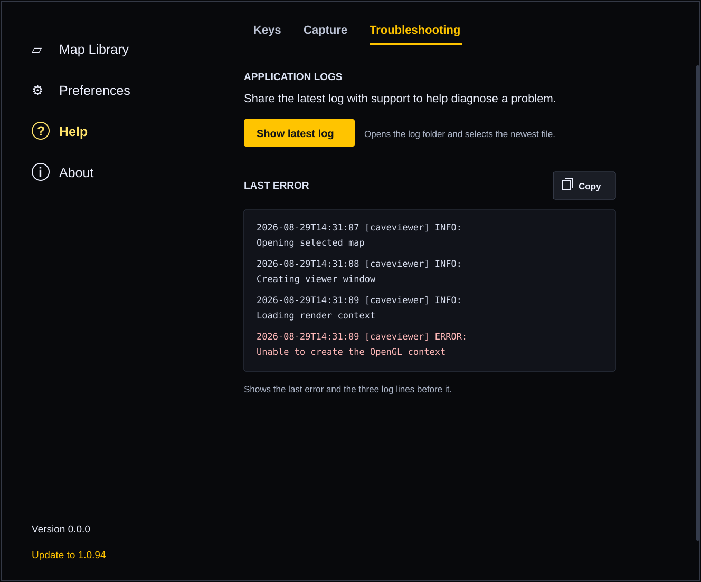

# Help troubleshooting logs

This work item defines a durable, cross-platform troubleshooting surface for
non-technical users. It is based on the current Help rendering shown in
[the reference screenshot](help-troubleshooting-reference.png) and the proposed
third-tab rendering below.

## Master plan

| ID | Description | Problem | Current implementation | Desired solution | Task details | Branch | Status |
| --- | --- | --- | --- | --- | --- | --- | --- |
| 1 | Define one discoverable application-log catalog. | Users cannot reason about platform-specific or hidden diagnostic paths, and the Help UI has no stable source from which to find the newest log or error. | `core.diagnostics.runtime` creates `viewer-session-<session>.log` and its JSONL companion under the application state directory only on Windows. `core.diagnostics.startup` separately owns `startup.log`; ordinary logging is otherwise configured for console streams. No core service catalogs user-facing logs across platforms. | 1. All supported desktop platforms write application session logs beneath one `diagnostics` directory resolved by `storage_paths`.  2. A GUI-free core catalog returns eligible logs newest-first using a deterministic timestamp/name fallback and exposes the latest readable file.  3. The catalog never includes benchmark logs, JSONL event data, cache files, or paths outside the diagnostics directory.  4. Existing diagnostic filenames remain readable; no public cache/update format or release path changes. | 1. Decide whether the existing Windows runtime session log becomes the cross-platform application session log or is adapted behind the catalog.  2. Define retention and bounded-read limits so startup and Help remain fast.  3. Implement pure catalog/query policy in `caveviewer.core.diagnostics`; keep directory creation and file access at the composition boundary.  4. Cover missing directories, ties, concurrent writes, deleted files, unreadable files, symlinks/path escape, and legacy `startup.log` behavior with focused tests.  5. Verification: diagnostics-focused tests passed (9 passed, 1 Windows symlink-privilege skip); the complete applicable Windows suite passed (1,940 passed, 23 skipped, 1 symlink-privilege deselection); compileall and `git diff --check` passed. The unfiltered suite additionally reported 16 Unix-script execution failures and the deselected symlink-privilege failure, all unrelated to this task and specific to this Windows host. | `feature/help-troubleshooting-logs` | In progress — pushed in `f2cb7ce` |
| 2 | Reveal the newest log from Help. | A user who is told to provide a log must manually locate a hidden directory. Native file browsers also preserve user-controlled sorting, so CaveViewer cannot guarantee that changing the folder sort will put the latest file at the top. | The Help panel is an embedded `TopTabbedContentSurface` with `Keys` and optional `Capture` tabs. Existing saved-artifact reveal adapters select a file in Explorer/Finder or use Linux desktop services, but diagnostics have no focused capability or action. | 1. Help contains a third `Troubleshooting` tab with a primary **Show latest log** button.  2. Activating the button opens the diagnostics directory and selects or scrolls to the newest eligible log without changing native folder preferences.  3. Keyboard activation, focus indication, screen-reader naming, and platform-specific failure feedback work.  4. If no log exists, the button is disabled and the empty state explains that a log will appear after the application records a session. | 1. Add a narrow log-reveal capability and platform adapter; reuse native reveal mechanics without coupling core diagnostics to Tk or subprocesses.  2. Resolve the newest log again at action time to avoid revealing a stale/deleted selection.  3. Use Explorer `/select,`, Finder reveal, and the supported Linux desktop-service route; reveal failures remain non-fatal and produce concise inline feedback.  4. Add the Troubleshooting tab to `HelpPanel` using the existing top-tab, spacing, color, button, scrollbar, and focus conventions.  5. Test tab presence, action-time refresh, all platform routes, unsupported routes, missing/deleted logs, and failure feedback.  6. Verification: focused Help/controller/platform tests passed (117 passed); the complete applicable Windows suite passed (1,949 passed, 23 skipped, 1 symlink-privilege deselection); compileall and `git diff --check` passed. | `feature/help-troubleshooting-logs` | In progress — pushed in `08d7c0d` |
| 3 | Show and copy the last error with context. | Users must search logs and may omit the lines that explain an error when asking for support. | Help renders static shortcut tables and has no log reader, error excerpt model, clipboard action, or dynamic empty/error state. Runtime text logs include parseable level markers, but exceptions may span multiple physical lines. | 1. The Troubleshooting tab shows the latest `ERROR` entry from the newest readable application log, preceded by up to three complete log lines in original order.  2. The complete error record, including its continuation or traceback lines, appears in a selectable-looking, wrapping monospace region.  3. A copy-icon button copies exactly the displayed excerpt and confirms **Copied** without changing the excerpt.  4. No-error and unreadable-log states are explicit and non-blocking. | 1. Implement a bounded, GUI-free reverse reader that recognizes timestamped log-record starts and continuation lines; select the newest complete `ERROR` record and its three preceding physical context lines without loading an unbounded file.  2. Define behavior for a log being appended or rotated during the read: use the last complete snapshot available and retry on a replaced file.  3. Render escaped plain text only; do not interpret links or markup.  4. Wire the copy icon to the Tk clipboard on the main thread, with tooltip/accessible label **Copy last error**, keyboard activation, focus styling, and inline success/failure feedback.  5. Refresh when the Troubleshooting tab is selected and after **Show latest log** returns; do not poll or perform unbounded I/O on the Tk thread.  6. Test LF/CRLF, Unicode, no error, fewer than three prior lines, multiline tracebacks, malformed/truncated records, large files, rotation, clipboard success/failure, exact copied text, wrapping, and narrow/scaled layouts.  7. Verification: focused diagnostics/controller/Help tests passed (102 passed, 1 Windows symlink-privilege skip); the complete applicable Windows suite passed (1,959 passed, 23 skipped, 1 symlink-privilege deselection); compileall and `git diff --check` passed. | `feature/help-troubleshooting-logs` | In progress — implementation verified |
| 4 | Verify the end-to-end troubleshooting experience. | Unit behavior alone cannot establish that a non-technical user can find and copy useful diagnostics on every supported desktop. | Existing Help tests enforce the quiet table, shared scroll host, spacing, and tab behavior; diagnostic and reveal adapters have separate unit coverage. There is no integrated troubleshooting workflow or user documentation. | 1. Automated contracts cover the core query, Help presentation, accessibility, and adapter dispatch.  2. A manual platform matrix verifies that the selected log is visible in Explorer, Finder, and the supported Linux file browser.  3. Manual verification confirms that copied error text matches the UI.  4. User-facing troubleshooting documentation points users to **Help > Troubleshooting**. | 1. Add focused tests under `tests/unit/core` and `tests/unit/gui`, preserving existing Help presentation contracts.  2. Run the focused tests, then `.venv/bin/python -m pytest -p no:cacheprovider -q`, the syntax check, and `git diff --check`.  3. Manually verify Windows, macOS, and Linux with normal, empty, permission-failure, long-error, and high text-scale states; record any unavailable platform validation in this row.  4. Update user documentation and screenshots if the Help UI ships with this feature.  5. Build/release workflow cleanup is out of scope because this design neither executes nor changes those workflows. | `feature/help-troubleshooting-logs` | Pending |

## Feature design

### Information architecture and rendering

`Troubleshooting` is a peer of `Keys` and `Capture`, not another left-navigation
destination. This keeps support tools under the existing Help destination and
uses the same tab strip shown in the supplied screenshot. The tab order is
`Keys`, `Capture`, `Troubleshooting`; if Capture is unavailable, Troubleshooting
still follows Keys.

The proposed rendering retains the screenshot's dark background, amber active
tab, pale text, generous left alignment, and right-side scrollbar. Content is
ordered by the user's troubleshooting task:

1. **Application logs** explains that logs can be shared with support and
   presents **Show latest log** as the primary action.
2. **Last error** presents the excerpt in a wrapping monospace region, with the
   copy icon at the heading's trailing edge.
3. A short status line below the action that communicates empty, reveal, copy,
   or failure state without a modal dialog.

The rendering is a design target rather than a pixel-perfect implementation.
It intentionally uses a compact representative excerpt; production text must
wrap, remain selectable-looking, and scroll with the shared Help content at
supported window sizes and UI text scales.

### User interaction

- Selecting `Troubleshooting` refreshes the catalog and excerpt once. It must
  not poll the filesystem while another Help tab is active.
- **Show latest log** resolves the latest eligible file again, invokes the
  platform reveal route, and then refreshes the displayed excerpt. The action
  never launches or executes the log itself.
- The native file browser keeps the user's current sort preference. CaveViewer
  satisfies “latest log on top” by selecting the newest file and requesting
  that it be brought into view; the app does not claim it can rewrite native
  sorting.
- The copy-icon button has the accessible name and tooltip **Copy last error**.
  It copies the three context lines plus the error record exactly as displayed,
  using platform line endings only at the clipboard boundary if required.
- Successful copy feedback changes to **Copied** briefly while retaining the
  accessible name. Failure feedback explains that the text can still be
  selected manually.

### Error excerpt contract

The “last error” is the final complete text-log record whose parsed level is
`ERROR` in the newest readable eligible log. An exception traceback and other
indented/non-record continuation lines belong to that error record. The three
context lines are the three preceding physical lines, in chronological order;
if fewer exist, all available lines are shown. This literal context rule makes
the result predictable and matches the product requirement without attempting
to infer semantic events.

Reading is bounded from the end of the file by bytes and displayed characters.
If the latest log is unreadable or has no complete error, the reader checks no
older file for a different error: the UI describes the state of the latest log
the user will reveal. The model distinguishes:

- **No logs yet** — no eligible application log exists.
- **No errors recorded in the latest log** — the latest log is readable but
  contains no complete `ERROR` record in the bounded search window.
- **Latest log is unavailable** — the selected file disappeared or could not
  be read; retry on the next tab selection/action.

### Boundaries and safety

- `caveviewer.core.diagnostics` owns log eligibility, ordering, and bounded
  excerpt parsing. It remains GUI-free.
- `caveviewer.gui.help_panel` owns rendering and interaction. It receives the
  current model and callbacks rather than resolving storage or launching
  processes itself.
- `caveviewer.gui.platform` owns native reveal capability and side effects.
  Existing saved-artifact reveal behavior may supply shared low-level helpers,
  but diagnostics use a focused interface and action-time preflight.
- Log files stay under the application state directory returned by
  `storage_paths`; the feature does not expose maps, caches, benchmark outputs,
  JSONL diagnostics, credentials, or arbitrary user-selected paths.
- The design adds no dependency and makes no cache, update, or release-format
  change. Log retention and cross-platform session logging must be finalized
  before implementation because they affect disk use and product support.

## Acceptance criteria

- Help visibly exposes a keyboard-accessible `Troubleshooting` tab alongside
  the existing Help tabs at all supported text scales.
- With logs present, **Show latest log** opens the correct application-log
  directory and selects the newest eligible log on each supported platform.
- With no logs, the reveal action is disabled and the UI provides a useful
  empty state without an exception or modal dialog.
- The displayed excerpt contains exactly the last complete `ERROR` record and
  up to three preceding physical lines from the latest log.
- The copy icon copies exactly the displayed excerpt and reports success or a
  recoverable clipboard failure.
- Large, growing, rotated, malformed, inaccessible, or missing logs cannot
  freeze or crash the Help surface and cannot escape the diagnostics directory.
- Focus order, accessible names, contrast, wrapping, scrolling, and keyboard
  activation are verified for the new controls.
- Focused and complete validation evidence is recorded in the master-plan rows
  before the feature is marked complete.

## Work-document maintenance

Keep this tracked work item current throughout implementation. Update task
status and record focused/full test commands, manual platform evidence, PR and
merge references, and any remaining external validation in the applicable
master-plan row. Split a row before implementation if investigation reveals an
independently reviewable migration or compatibility change.
